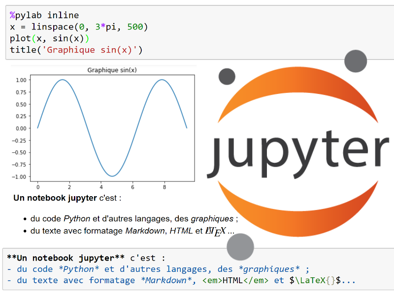

Un notebook jupyter permet de rapidement publier un compte rendu scientifique multimédia sur le Web.

Voici ci dessous quelques exemples à lire dans [nbviewer](https://nbviewer.org/) puis à télécharger pour y expérimenter certaines fonctionnalités :

- [Decouverte-Le_BN_de_prise_en_main](https://nbviewer.org/urls/ericecmorlaix.github.io/bn/decouverte-notebook.ipynb)

- [Markdown-Le_BN_pour_rapporter](https://nbviewer.org/urls/ericecmorlaix.github.io/bn/MarkDown-Le_BN_pour_rapporter.ipynb)

- [HTML-Le_BN_pour_multimedier](https://nbviewer.org/urls/ericecmorlaix.github.io/bn/HTML-Le_BN_pour_multimedier.ipynb)

- [LaTeX-Le_BN_pour_formuler](https://nbviewer.org/urls/ericecmorlaix.github.io/bn/LaTeX-Le_BN_pour_formuler.ipynb)

- [Arithmetique-Le_BN_pour_calculer](https://nbviewer.org/urls/ericecmorlaix.github.io/bn/Arithmetique-Le_BN_pour_calculer.ipynb)

